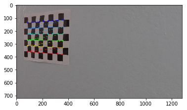
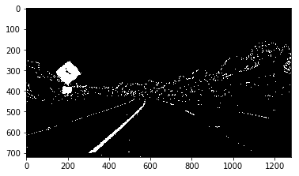
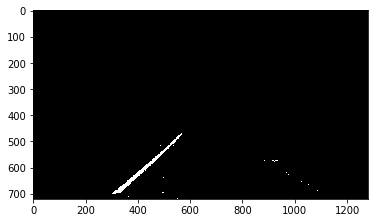
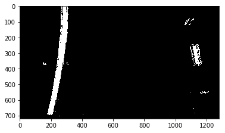
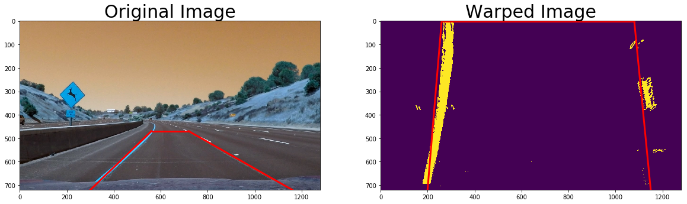
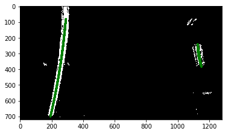
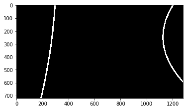
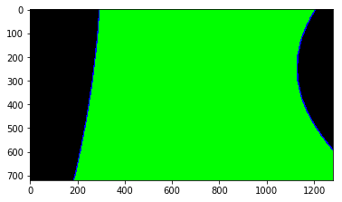
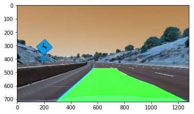
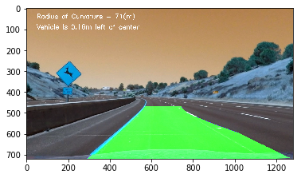

## Advanced Lane Finding

### Project Instructions / Project Scope

The goals / steps of this project are the following:

* Compute the camera calibration matrix and distortion coefficients given a set of chessboard images.
* Apply the distortion correction to the raw image.
* Use color transforms, gradients, etc., to create a thresholded binary image.
* Apply a perspective transform to rectify binary image ("birds-eye view"). 
* Detect lane pixels and fit to find lane boundary.
* Determine curvature of the lane and vehicle position with respect to center.
* Warp the detected lane boundaries back onto the original image.
* Output visual display of the lane boundaries and numerical estimation of lane curvature and vehicle position.

The requirements are defined in [Rubric](https://review.udacity.com/#!/rubrics/1966/view)

### Project folder structure
* Implementation code is in file [Advanced_Lane_Finding.ipynb](./Advanced_Lane_Finding.ipynb)
* The images for camera calibration are in folder `camera_cal`, camera calibration result is stored in file [calibration_result.p](./calibration_result.p)
* Helper function is in file [helperfunction.py](./helperfunction.py)
* Result images are stored in folder `result_images`
* Video output are [output_video.mp4](./output_video.mp4), [challenge_output_video.mp4](./challenge_output_video.mp4), [harder_challenge_output_video.mp4](./harder_challenge_output_video.mp4)

## Project document
The code for each step is correspondingly in each section of `Advanced_Lane_Finding.ipynb`

## Camera Calibration and correct distortion calculation for 9x6 chessboard image

I begin the camera calibration with "object points", which will be the (x, y, z) coordinates of the chessboard corners in the world. Here I am assuming the chessboard is fixed on the (x, y) plane at z=0, such that the object points are the same for each calibration image.  Thus, `objp` is just a replicated array of coordinates, and `objpoints` will be appended with a copy of it every time I successfully detect all chessboard corners in a test image.  `imgpoints` will be appended with the (x, y) pixel position of each of the corners in the image plane with each successful chessboard detection. 

Then I scan through every images in the list of calibration_images to find and draw corners in an image of a chessboard pattern.

I then used the output objpoints and imgpoints to compute the camera calibration and distortion coefficients using the cv2.calibrateCamera() function. I applied this distortion correction to the test image using the cv2.undistort() function and obtained this result:

## Pipeline for single image

### 1. Distortion-corrected for example image

To demonstrate this step, I will describe how I apply the distortion correction to one of the test images:

* Load the calibration result from file `calibration_result.p`.
* Read the example image and then call `cv2.undistort()` to correct distortion
* Plot the original image and after distorted-correction image

#### Example of undistored image from test_image2.jpg

### 2. Apply color transforms, gradients to create a thresholded binary image

I used a combination of gradient and color thresholds to generate a binary image (thresholding steps with sobelx operation threshold `xgrad_threshold = (40,100)` and HLS color space S threshold `s_threshold = (150,255)` and call `apply_threshold_v2()` in `helperfunction.py`). Here's an example of my output for this step.

#### Binary image after HLS S threshold color transform and Sobelx operation

### 3. Perform perspective transform to create "bird-eye-view" image

I select only a hard-coded region of interest using a binary image mask. I only keep the region of the image defined by the polygon defined by `vertices` vector. The rest of the image is set to black.

#### Masked binary image region of interest  

The code for my perspective transform includes a function called warper(). The warper() function takes as inputs an image (img), as well as source (src) and destination (dst) points. I chose the hardcode the source and destination points for my test image (`img_size = (720,1280)`) are:

| Source        | Destination   | 
|:-------------:|:-------------:| 
| 305, 740      | 200, 720      | 
| 550, 470      |200, 0         |
| 720, 470      | 1080, 0       |
| 1160, 720     | 1080, 720     |

#### Bird-eye-view binary image

I verified that my perspective transform was working as expected by drawing the src and dst points onto a test image and its warped counterpart to verify that the lines appear parallel in the warped image.

#### Verification between original image and warped image counter part

### 4.Identify lane-line pixels and fit their positions with a polynomial

#### Identify lane line pixels process

To identify the lane line, we perform:
* Divide the image into n horizontal strips (steps) of equal height.
* For each step, take a count of all the pixels at each x-value within the step window using a histogram generated from np.sum.
* Smoothen the histogram using scipy.signal.medfilt.
* Find the peaks in the left and right halves (one half for each lane line) histogram using signal.find_peaks_swt.
* Get (add to our collection of lane line pixels) the pixels in that horizontal strip that have x coordinates close to the two peak x coordinates.

These steps are implemented by `histogram_pixels()` in `helperfunction.py`.

#### Fit position of lane-line pixels with a polynomial

Fit a second order polynomial to each lane line using np.fitpoly by `fit_second_order_poly()` in `helperfunction.py`.

##### Fit second order polynomial to left and right lane lines

Draw the polynomial binary image with the coeffients found by `draw_poly()` in helper function `helperfunction.py`.

##### Draw polynomial binary image

Highlight the area between 2 lanes by `hightlight_lane_line_area()` in `helperfunction.py`

##### Highlight the area between 2 lanes

### 5. Calculate the radius of curvature of the lane and the position of the vehicle with respect to center

radius of curvature: 
* left radius: `left_curve_radius = np.absolute(((1 + (2 * left_coefficients[0] * y_eval + left_coefficients[1])**2) ** 1.5)/(2 * left_coefficients[0]))`
* right radius: `right_curve_radius = np.absolute(((1 + (2 * right_coefficients[0] * y_eval + right_coefficients[1]) ** 2) ** 1.5)/(2 * right_coeffs[0]))`

### 6. Example image plotted back down onto the road such that the lane area is identified clearly
The process is as followed:
* Warp lane lines back onto original image using `cv2.warpPerspective`
* Plot the warped image
* Output visual information display onto the image

#### Warped image onto the original image

#### Output visual information onto the original image

## Image pipeline

Combine all the steps above to create the `image_pipeline()` in file `Advanced_Lane_Finding.ipynb` for video pipeline.

### Test image pipeline with different test image

## Video pipeline

### Project Output Video
Use the image pipeline to generate video project output with lane finding information. Here's the [output_video](./output_video.mp4).

Remarks: 
* The pipeline works pretty good on the whole project video
* The 2 lanes are detected and displayed information accordingly

### Challenge Output Video
Use the same image pipeline for challenge output video. Here's the [challenge_output_video](./challenge_output_video.mp4).

### Challenge Output Video
Use the same image pipeline for harder challenge output video. Here's the [harder_challenge_output_video](./harder_challenge_output_video.mp4).

### Discussion
Remarks for the challenge output video result:
* The pipeline missed the left lane frequently due to damage on the road (there is a shift in gradient when the road is damaged). Proposed solution: filter the damage on the road with width define. Plot a rectange for each line after color and gradient thresholding, use threshold to filter the small damage on road mistaken as line.
* Without the change in lightning condition, the right lane detection is correct

Remarks for harder challenge output video result:
* The pipeline failed many times when the car is moving fast downwards the hill or when the road is rough
* When a sharp curve appears, pipeline failed immediately
* Lightning condition when driving in shady area with trees (color change significantly) causes the color and gradient threshold method to fail. Proposed solution: We need to adaptive method for color transform. I would suggest to use Machine Learning algorithm such as Polynomial Regression with 2 vector features S value and average brightness to change the threshold accordingly
 
