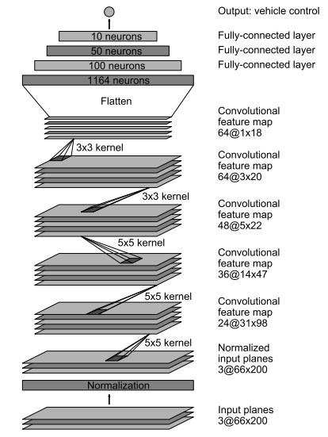
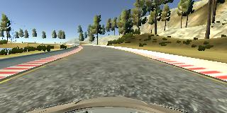
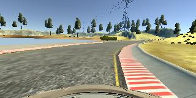
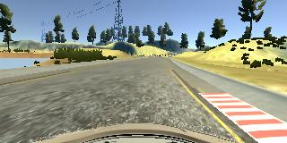
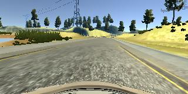
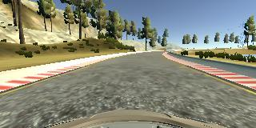
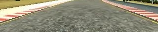

# **Behavioral Cloning** 

## Writeup Template

---

**Behavioral Cloning Project**

The goals / steps of this project are the following:
* Use the simulator to collect data of good driving behavior
* Build, a convolution neural network in Keras that predicts steering angles from images
* Train and validate the model with a training and validation set
* Test that the model successfully drives around track one without leaving the road
* Summarize the results with a written report

### Project change log
* Ver 0.0 : Initial submission

## Rubric Points
### Here I will consider the [rubric points](https://review.udacity.com/#!/rubrics/1968/view) individually and describe how I addressed each point in my implementation.  

---
### Files Submitted & Code Quality

#### 1. Submission includes all required files and can be used to run the simulator in autonomous mode

My project includes the following files:
* Implementation CNN model code is in file [model.py](./model.py)
* The script to drive the car (with modification) is in file [drive.py](./drive.py)
* The model trained convolutional neural network is in file [model.h5](./model.h5)
* The video demo recording of vehicle driving autonomously around track 1 [video.mp4](./video.mp4)
* The readme images, CNN architecture visualization are stored in folder `readme_images`
* Training images data for CNN are stored in `training_data`
* Images to generate video demo are stored in `video` 
* Report summary in README.md

#### 2. Submission includes functional code
Using the Udacity provided simulator and my drive.py file, the car can be driven autonomously around the track by executing 
```sh
python drive.py model.h5
```

#### 3. Submission code is usable and readable

The model.py file contains the code for training and saving the convolution neural network. The file shows the pipeline I used for training and validating the model, and it contains comments to explain how the code works.

### Model Architecture and Training Strategy

#### 1. An appropriate model architecture has been employed

My model consists of a convolution neural network with 2x2 filter sizes, depths between 24 and 64 and includes RELU layers to introduce nonlinearity (model.py lines 101-119).

````python
model.add(Convolution2D(24, 5, 5, border_mode='same', subsample=(2, 2)))
model.add(Activation('relu'))
model.add(MaxPooling2D(pool_size=(2, 2), strides=(1, 1)))

model.add(Convolution2D(36, 5, 5, border_mode='same', subsample=(2, 2)))
model.add(Activation('relu'))
model.add(MaxPooling2D(pool_size=(2, 2), strides=(1, 1)))

model.add(Convolution2D(48, 5, 5, border_mode='same', subsample=(2, 2)))
model.add(Activation('relu'))
model.add(MaxPooling2D(pool_size=(2, 2), strides=(1, 1)))

model.add(Convolution2D(64, 3, 3, border_mode='same', subsample=(1, 1)))
model.add(Activation('relu'))
model.add(MaxPooling2D(pool_size=(2, 2), strides=(1, 1)))

model.add(Convolution2D(64, 3, 3, border_mode='same', subsample=(1, 1)))
model.add(Activation('relu'))
model.add(MaxPooling2D(pool_size=(2, 2), strides=(1, 1)))
  ````

The data is normalized in the model using a Keras lambda layer (code line 98).
````python
model.add(Lambda(lambda x: x / 127.5 - 1.0, input_shape=(40,160,3)))
  ````

#### 2. Attempts to reduce overfitting in the model
The model was trained and validated on different data sets to ensure that the model was not overfitting (code line 43). The model was tested by running it through the simulator and ensuring that the vehicle could stay on the track.
````python
train_samples, validation_samples = train_test_split(lines, test_size=0.1)
  ````

#### 3. Model parameter tuning

The model used an adam optimizer, so the learning rate was not tuned manually (model.py line 138).
````python
model.compile(optimizer=Adam(0.0001), loss="mse", metrics=['accuracy'])
  ````

#### 4. Appropriate training data

Training data was chosen to keep the vehicle driving on the road. I used a combination of center lane driving, recovering from the left and right sides of the road.

The model was trained by driving a car in the first track of Udacity's car-driving simulator. Each datapoint comprised 7 attributes:

* Image taken from the center camera on the car (320 x 160 pixel image with 3 colour channels)
* Image taken from the left camera on the car
* Image taken from the right camera on the car
* Throttle
* Speed
* Brake
* Steering angle (variable to predict, a float ranging from -1.0 to 1.0 inclusive)

I recorded myself driving around Track 1 using the keyboard.

Then I use image augmentation by flipping the data set, add correction to left and right image to create center image augmentation. The whole augmented data would be added to the original data before model training.
 
For details about how I created the training data, see the next section.

### Model Architecture and Training Strategy

#### 1. Solution Design Approach

I started with my own CNN architecture with 3 convolutional layers and 2 fully connected layer. However, the result was not promising. After multiple attempts, the vehicle still drove off the road or fell in the river.

Then I found the recommeded architecture for NVIDIA. This model architecture is a solution from [NVIDIA Architecture](https://images.nvidia.com/content/tegra/automotive/images/2016/solutions/pdf/end-to-end-dl-using-px.pdf) for steering control of autonomous vehicle. This model improves the result significantly with 5 convolutional layers, 3 fully connected layers and documented success of the network for steering control. In order to verify if the model is working with my dataset, I split my image and steering angle data into a training and validation set in 80 to 20 ratio. The final step was to run the simulator to see how well the car was driving around the track.

At the end of the process, the vehicle is able to drive autonomously around the first track without leaving the road.

#### 2. Final Model Architecture

The final model architecture (model.py lines 87-138) consisted of a convolution neural network with the following layers and layer sizes:

| Layer                            |    Size       |
| --------------------             |:-------------:|
| Input (crop and resize)          | 40 x 160 x 3  |
| Lambda (normalization)           | 40 x 160 x 3  |
| Convolution with relu activation | 5 x 5 x 24 with 2x2 filters  |
| Convolution with relu activation | 5 x 5 x 36 with 2x2 filters  |
| Convolution with relu activation | 5 x 5 x 48 with 2x2 filters  |
| Convolution with relu activation | 3 x 3 x 64   |
| Convolution with relu activation | 3 x 3 x 64   |
| Flatten                          |              |
| Fully connected                  | 100          |
| Fully connected                  | 50          |
| Fully connected                  | 10          |
| Output                           | 1          |

Here is a visualization of the architecture:



#### 3. Creation of the Training Set & Training Process

To capture good driving behavior, I first recorded two laps on track one using center lane driving. Here is an example image of center lane driving:



I then recorded the vehicle recovering from the left side and right sides of the road back to center so that the vehicle would learn to navigate the turns instead of memorizing the track. These images show what a recovery looks like starting from right to center :







Then I repeated this process on track two in order to get more data points.

To augment the data set, I also flipped images and angles thinking that this would help generalize the model. For example, here is an image that has then been flipped:




After the collection process, I had 23426 number of data points. I then preprocessed this data by cropping Crop 70 pixels from the top of the image and 25 from the bottom to remove irrelevant data (sample below).




I finally randomly shuffled the data set and put 10% of the data into a validation set. 

I used this training data for training the model. The validation set helped determine if the model was over or under fitting. The ideal number of epochs was 5 as evidenced by 5 epochs table (below) I used an adam optimizer so that manually training the learning rate wasn't necessary.

| Epochs                           |    Loss       |
| --------------------             |:-------------:|
| 1          			   | 0.02543  |
| 2           			   | 0.01912  |
| 3 				   | 0.01827  |
| 4 				   | 0.01753  |
| 5 				   | 0.01743  |

