# **Traffic Sign Recognition** 

## Writeup

### You can use this file as a template for your writeup if you want to submit it as a markdown file, but feel free to use some other method and submit a pdf if you prefer.

---

**Build a Traffic Sign Recognition Project**

The goals / steps of this project are the following:
* Load the data set (see below for links to the project data set)
* Explore, summarize and visualize the data set
* Design, train and test a model architecture
* Use the model to make predictions on new images
* Analyze the softmax probabilities of the new images
* Summarize the results with a written report

## Rubric Points
### Here I will consider the [rubric points](https://review.udacity.com/#!/rubrics/481/view) individually and describe how I addressed each point in my implementation.  

---
### Writeup / README

#### 1. Provide a Writeup / README that includes all the rubric points.
You're reading it! and here is a link to my [project code](./Traffic_Sign_Classifier.ipynb)

### Data Set Summary & Exploration

#### 1. Provide a basic summary of the data set. In the code, the analysis should be done using python, numpy and/or pandas methods rather than hardcoding results manually.

I used the pandas library to calculate summary statistics of the traffic
signs data set:

* The size of training set is 34799
* The size of the validation set is 4410
* The size of test set is 12630
* The shape of a traffic sign image is (32,32,3)
* The number of unique classes/labels in the data set is 43

#### 2. Include an exploratory visualization of the dataset.
Visualize the German Traffic Signs Dataset using the pickled file(s). This is open ended, suggestions include: plotting traffic sign images, plotting the count of each sign, etc.

##### Dataset Visualization with 12 sample images

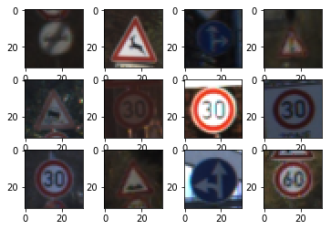

##### A sample traffic sign

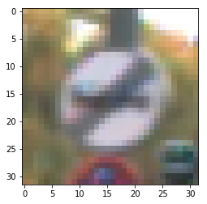

Here is an exploratory visualization of the data set. It is a bar chart showing how the data is collected. The training dataset for the distribution of the various classes, the classes were found to be highly scattered. Therefore, we will have to apply some data preprocessing to improve feature extraction.

##### Dataset distribution

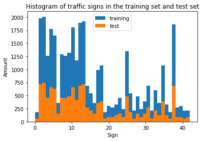

### Design and Test a Model Architecture

#### 1. Preprocess the Data set(shuffling, normalization)

Shuffling data set serves the purpose of reducing variance and making sure that my CNN models remain general and overfit less. In this case, I apply the `shuffle()` function from `sklearn`.

The image data is then normalized so that the data has mean zero and equal variance.

##### Image visualization before and after normalization

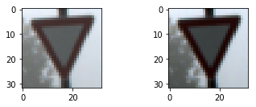

#### 2. Split the dataset into train, validation set

Split the data set into training and validation set with 80% training samples and 20% validation samples.

#### 3. Model architecture

At the beginning, I tried with 3 different architecture from the article [CNN Design for Real-Time Traffic Sign Recognition](https://www.sciencedirect.com/science/article/pii/S1877705817341231). The second architecture offers the promising result with accuracy > 0.92 and fewer convolutional layers. After a few unsuccessful attemps to modify the parameter, I added 1 more fully connected layer and chose the folowing architecture: 

* **First layer**: Convolutional layer (feature extraction)
* **Second layer**: Fully connected neural layer with Rectifier Linear Unit (ReLU) activation
* **Third layer**: Another fully connected neural layer with ReLU activation
* **Output classification layer**: Fully connected neural network layer

The convolutional network takes 3 channels color information and normalised data as input.

The parameters for each layer are listed in the table below:

| Layer         | Dimension           | Parameters  |
| ---   | ---        | ---        |
| Convolutional Layer | <ul><li>Input = (32,32,3)</li><li>Output = (5,5,32) then flatten to 800</li></ul> | <ul><li>VALID padding</li><li>Kernel size = (3,3)</li><li>Number of filters = 32</li><li>Pooling size = (2,2)</li><li>ReLU activation</li><li>drop out = 90%</li></ul> |
| Fully Connected Layer 1 | <ul><li>Input = 800</li><li>Output = 512</li></ul> | <ul><li>ReLU activation</li><li>drop out = 90%</li><li>WX+b</li></ul> |
| Fully Connected Layer 2 | <ul><li>Input = 512</li><li>Output = 128</li></ul> | <ul><li>ReLU activation</li><li>drop out = 90%</li><li>WX+b</li></ul> |
| Classification Layer | <ul><li>Input = 128</li><li>Output = 43</li></ul> | <ul><li>WX+b</li><li>Softmax</li></ul> |

##### Model architecture visualization

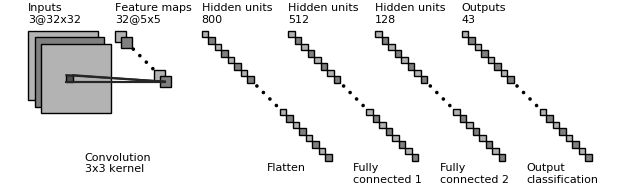

I am using the python function blocks to implement convolutional network architecture from [aymericdamien/TensorFlow-Examples](https://github.com/aymericdamien/TensorFlow-Examples/tree/master/examples/3_NeuralNetworks)

#### 4. Train, Validate and test model 
A validation set can be used to assess how well the model is performing. A low accuracy on the training and validation sets imply underfitting. A high accuracy on the training set but low accuracy on the validation set implies overfitting.

After multiple experiments and observations (details in the solution approach), I choose the set of parameters:
* learning_rate = 0.001
* training_epochs = 60
* batch_size = 100

**Training accuracy** = 0.993319

**Validation accuracy** = 0.965517

**Test accuracy** = 0.774505

#### 4. Solution approach

My final model results were:
* training accuracy of 0.993319
* validation set accuracy of 0.962787 
* test set accuracy of 0.763341

If an iterative approach was chosen:
* I started with a fundamental multilayer perceptron from Tensorflow but the result is not promissing (trained for 20 epochs, the result was only 10% accuracy)
* Then I found the paper [CNN Design for Real-Time Traffic Sign Recognition](https://www.sciencedirect.com/science/article/pii/S1877705817341231). There are 3 architectures presented in the papers. The first one included 7 convolutional layers, 2 fully connected layers, 1 softmax layer. This architecture can reach 93% accuracy but the number of layer is very large. The second architecture can reach 90% and fairly simple to implement.
* I then added a convolution layer to my original model before the two fully connected layers and the output layer.
* This updated model produced a validation accuracy of above 90% after 15 epochs (parameters not tuned), which was higher than before. So I chose this model with a convolution layer.
* I modified by adding one more fully connected layer, dropout 90% and pooling.
* Then I tune the parameters : learning rate, epochs, batch size

The idea of my parameter tuning is finding a maximum value of validation accuracy with learning rate tuning then we find the optimal epochs for that learning rate. I would use batch size = 100 and drop out = 0.9 as recommended (also from experience). By applying this approach, I would achieve a maximum validation accuracy with minimal epochs required ( better accuracy and less training time).

The parameter tuning process is:

* Fix the training epochs at 100, batch size at 100, drop out = 0.9
* Run the experiment with recommended alpha learning rate parameters `[0.0005,0.001,0.003,0.005,0.01,...]`
* Start with `0.0005`. If the validation accuracy increases, continue to the next learning value in the list. When the validation accuracy starts to decrease comparing to the last learning rate parameter. Choose the previous learning rate.
* In case validation accuracy decreases from `0.0005`, reduce the learning rate to `[...,0.0001,0.0003]` to find a local maximum of validation accuracy.
* Run the chosen alpha learning rate and plot the validation accuracy and cost with respect to epochs.
* Choose the training epochs when the accruracy curve flattens. At that epoch, the cost should be closed to 0.
 
Alpha learning rate experiment result:

| Parameters         | Training Accuracy | Validation Accuracy           | Test accuracy  |
| ---   | ---        | ---        |  ---        |
| <ul><li>Learning rate: 0.0005</li><li>Training Epochs: 100</li><li>Batch size: 100</li></ul> | 0.994525 | 0.962787 | 0.763341 |
| <ul><li>Learning rate: 0.001</li><li>Training Epochs: 100</li><li>Batch size: 100</li></ul> | 0.993319 | 0.968534 | 0.763025 |
| <ul><li>Learning rate: 0.001</li><li>Training Epochs: 100</li><li>Batch size: 100</li></ul> | 0.985721| 0.949282 | 0.751306 |

**Training Parameters:**

* Learning rate: 0.0005
* Training Epochs: 100
* Batch size: 100
* Type of optimiser: AdamOptimizer
* Dropout (conv layer): 0.9
* Dropout (fully connected layers): 0.9
* Padding: VALID

**Training accuracy**: 0.994525

**Validation accuracy**: 0.962787

**Test accuracy**: 0.763341

The result is documented in file [alpha_0.0005_batchsize_100_epochs_100.csv](output/alpha_0.0005_batchsize_100_epochs_50.csv)

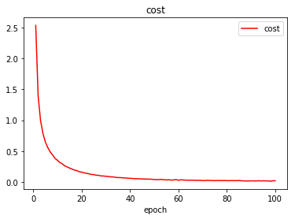

**Training Parameters:**

* Learning rate: 0.001
* Training Epochs: 100
* Batch size: 100
* Type of optimiser: AdamOptimizer
* Dropout (conv layer): 0.9
* Dropout (fully connected layers): 0.9
* Padding: VALID

**Training accuracy**: 0.993319

**Validation accuracy**: 0.968534

**Test accuracy**: 0.763025

The result is documented in file [alpha_0.001_batchsize_100_epochs_100.csv](output/alpha_0.001_batchsize_100_epochs_50.csv)

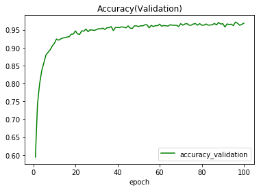

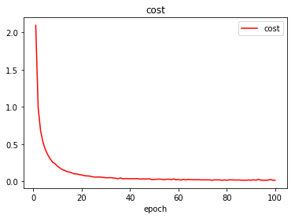

**Training Parameters:**

* Learning rate: 0.003
* Training Epochs: 100
* Batch size: 100
* Type of optimiser: AdamOptimizer
* Dropout (conv layer): 0.9
* Dropout (fully connected layers): 0.9
* Padding: VALID

**Training accuracy**:0.985721

**Validation accuracy**: 0.949282

**Test accuracy**: 0.751306

The result is documented in file [alpha_0.003_batchsize_100_epochs_100.csv](output/alpha_0.003_batchsize_100_epochs_100.csv)

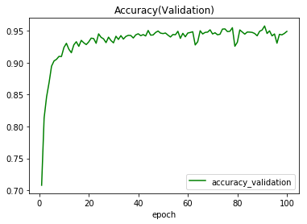

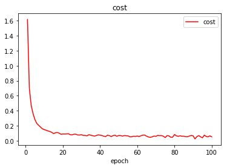

By observing the accuracy and cost for alpha learning rate and epoch values, the model reachs the 96% validation accuracy and the cost reduces to `0.027` which is `< 2% beginning cost (2.2)` after 50 epochs with the set of parameter `learning_rate = 0.001`, `batch_size = 100`, `training_epochs = 60`. After that, the validation accuracy fluctuates slightly at 96% and almost no improvement. After 60 epochs, the accuracy on test set stays around 76%.

### Test a Model on New Images

#### 1. Load and Output the image

Here are five German traffic signs that I found on the web:

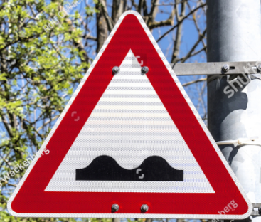

The fifth picture may be difficult to classify because it does not exist in the data set and the sign could be different in many countries

#### 2. Predict the sign type for each image

Here are the results of the prediction:

| Image			        |     Prediction  			| 
|:---------------------:|:---------------------------------------------:| 
| Bumpy Road Sign      		| Bumpy Road Sign			| 
| Priority Road Sign		| Priority Road Sign			|
| Stop Sign			| Stop Sign 				|
| Ahead Only Sign      		| Ahead Only Sign			|
| End of Road Sign		| Priority Sign				|

The model was able to correctly guess 4 of the 5 traffic signs, which gives an accuracy of 80%. This compares favorably to the accuracy on the test set of 75%

#### 3. Output Top 5 Softmax Probabilities For Each Image Found on the Web

For each of the new images, print out the model's softmax probabilities to show the **certainty** of the model's predictions (limit the output to the top 5 probabilities for each image).

For the first image, the model is relatively sure that this is a stop sign (probability of 0.8), and the image does contain a bumpy road sign. The top five soft max probabilities were

| Probability         	|     Prediction	       			| 
|:---------------------:|:---------------------------------------------:| 
| 0.96         		| Bumpy Road Sign				| 
| 0.04     		| Traffic Signals				|
| 0			| No Vehicles					|
| 0	      		| Road work	 				|
| 0			| Slippery Road 				|

For the second image, the model is sure that this is a priority road sign (probability of 1.0), and the image does contain a priority road sign. The top five soft max probabilities were.

| Probability         	|     Prediction	       			| 
|:---------------------:|:---------------------------------------------:| 
| 1.0         		| Priority road sign				| 
| 0     		| Speed limit (20km/h)				|
| 0			| Speed limit (30km/h)				|
| 0	      		| Speed limit (50km/h) 				|
| 0			| Speed limit (60km/h) 				|

For the third image, the model is sure that this is a stop sign (probability of 1.0), and the image does contain a stop sign. The top five soft max probabilities were.

| Probability         	|     Prediction	       			| 
|:---------------------:|:---------------------------------------------:| 
| 1.0         		| Stop sign					| 
| 0     		| Speed limit (20km/h)				|
| 0			| Speed limit (30km/h)				|
| 0	      		| Speed limit (50km/h) 				|
| 0			| Speed limit (60km/h) 				|

For the fourth image, the model is sure that this is a stop sign (probability of 1.0), and the image does contain a stop sign. The top five soft max probabilities were.

| Probability         	|     Prediction	       			| 
|:---------------------:|:---------------------------------------------:| 
| 1.0         		| Ahead Only					| 
| 0     		| Speed limit (20km/h)				|
| 0			| Speed limit (30km/h)				|
| 0	      		| Speed limit (50km/h) 				|
| 0			| Speed limit (60km/h) 				|

For the fifth image, the model confuses the sign as priority road instead of end of road.The top five soft max probabilities were.

| Probability         	|     Prediction	       			| 
|:---------------------:|:---------------------------------------------:| 
| 1.0         		| Priority Road					| 
| 0     		| Speed limit (20km/h)				|
| 0			| Speed limit (30km/h)				|
| 0	      		| Speed limit (50km/h) 				|
| 0			| Speed limit (60km/h) 				|
